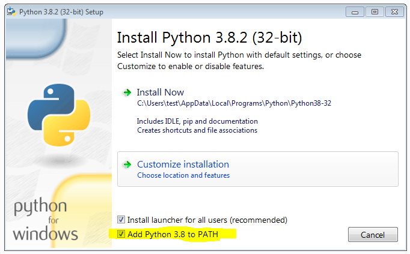

# Statistische Hypothesentests auf stetige Gleichverteilung
Enthält statistische Tests auf Gleichverteilung und Monte-Carlo-Simulationen um diese Tests miteinander zu vergleichen.
Dieses Repository enthält den Quellcode meiner Masterarbeit zu diesem Thema.
Die Masterarbeit an sich, die den theoretischen Teil abdeckt sowie erklärt, wie diese Software zu benutzen, liegt ebenfalls in diesem Repository.

Für Rückfragen stehe ich jederzeit gern zur Verfügung.

Kontakt: willi_sontopski@arcor.de

## Notwendige Pakete (die nicht in der Standard-Bibliothek enthalten sind)
- `numpy`
- `matplotlib`

## Schnellstartanleitung (für Windows)
1. Downloade und installiere Python https://www.python.org/
   Dabei empfiehlt es sich gleich bei der Installation die Umgebungsvariable zu setzen:
   

2. Installiere die notwendigen Python Pakete mit dem Paketmanager `pip`. Falls du die Umgebungsvariable gesetzt hast, kann du einfach die Eingabeaufforderung öffnen und die Pakete installieren via
    ```
    pip install numpy
    pip install matplotlib
    ```
    Falls du die Umgebungsvariable *nicht* gesetzt hast (Standard-Einstellung bei der Installation), musst du mit der Eingabeaufforderung zuerst in das Verzeichnis navigieren, in welchem Pip liegt.
    Das ist standardmäßig `C:\Users\benutzername\AppData\Local\Programs\Python\Python38-32\Scripts`.
    Hierbei musst `benutzername` durch deinen Windows-Benutzernamen ersetzen und `Python38-32` an deine Python-Version anpassen.
    Die fehlenden Pakete installierst du dann mit
    ```
    cd "C:\Users\benutzername\AppData\Local\Programs\Python\Python38-32\Scripts"
    pip install numpy
    pip install matplotlib
    ```
3. Lade die Dateien in diesem Repository herunter.
4. Öffne die Datei `main.py` mit einem Text-Editor und wähle die Parameter nach deinen Wünschen. Speichere die Datei, damit die Änderungen wirksam werden.
5. Starte die Simulationssoftware, indem du eine Eingabeaufforderung in dem Verzeichnis öffnest, in welchem die Datei `main.py` liegt und einfach nur `main.py` eingibst.

## Lizenz


This work is licensed under a
[Creative Commons Attribution-NonCommercial-ShareAlike 4.0 International License](http://creativecommons.org/licenses/by-nc-sa/4.0/).


